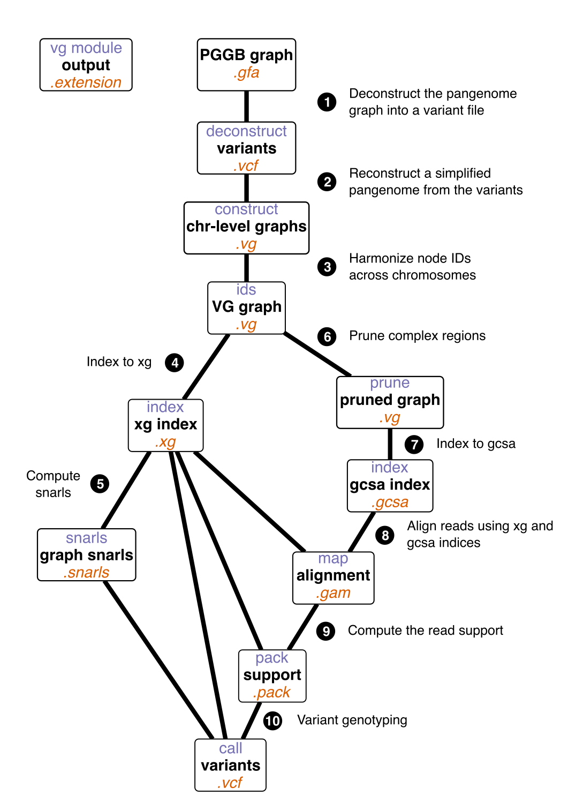

# Pangenome: variant genotyping
Tags: #pangenome #pggb #vg #gwas
🏠 [home](README.md)
***

> [! info] Purpose
> Genotype the variants embedded in the graph.

## overview


## construst per chr
To generate a simpler reference pangenome light enough for computational purposes, a graph is reconstructed by selecting in the pangenome a reference genome and representing the variants relative to it. The selected reference will be called `ref_name`.

We follow the construct approach from here: https://github.com/vgteam/vg/wiki/Index-Construction#without-haplotypes-1

All the VCFs were created previously, during the variant analysis [0.07_infer_variants](0.07_infer_variants.md)
It should output one path for each chromosome.

```bash
# bgzip and tabix to query chromosome structure
for i in {01..19}; do /usr/bin/time -v -o logs/${process}.chr${i}.timelog bgzip -c deconstruct/all.on.all.wfmash_s10000p85n1.chr${i}.seqwish_k49.smooth.deconstruct_${ref_name}.vcf > deconstruct/all.on.all.wfmash_s10000p85n1.chr${i}.seqwish_k49.smooth.deconstruct_${ref_name}.vcf.bgz; tabix -p vcf deconstruct/all.on.all.wfmash_s10000p85n1.chr${i}.seqwish_k49.smooth.deconstruct_${ref_name}.vcf.bgz 2> logs/${process}.chr${i}.err; done

# construct
for i in {01..19}; do VCF_ARGS=(); for CHROM in $(cat deconstruct/all.on.all.wfmash_s10000p85n1.chr${i}.seqwish_k49.smooth.paths | sort | grep ${ref_name}); do VCF_ARGS+=(-R ${CHROM}); done; /usr/bin/time -v -o logs/${process}.chr${i}.timelog vg construct -C "${VCF_ARGS[@]}" -r fasta/${ref_name}.fasta -v deconstruct/all.on.all.wfmash_s10000p85n1.chr${i}.seqwish_k49.smooth.deconstruct_${ref_name}.vcf.bgz -t 96 -m 32 > vg/reconstruct_${ref_name}.chr${i}.vg 2> logs/${process}.chr${i}.err

# stats
for i in {01..19}; do /usr/bin/time -v -o logs/${process}.chr${i}.timelog vg stats -z -l vg/reconstruct_${ref_name}.chr${i}.vg > vg/reconstruct_${ref_name}.chr${i}.stats 2> logs/${process}.chr${i}.err; done

for i in {01..19}; do /usr/bin/time -v -o logs/${process}.chr${i}.timelog vg paths -E -v vg/reconstruct_${ref_name}.chr${i}.vg > vg/reconstruct_${ref_name}.chr${i}.paths 2> logs/${process}.chr${i}.err; done 
```

## correct the id space

https://github.com/vgteam/vg/wiki/Index-Construction#without-haplotypes-2

```bash
# join ids
for i in $(ls vg/reconstruct_${ref_name}.chr*.vg); do VG_ARGS+=(${i}); done; /usr/bin/time -v -o logs/${process}.timelog vg ids -j "${VG_ARGS[@]}" 2> logs/${process}.err

# stats
for i in {01..19}; do /usr/bin/time -v -o logs/${process}.chr${i}.timelog vg stats -r vg/reconstruct_${ref_name}.chr${i}.vg > vg/reconstruct_${ref_name}.chr${i}.idsrange 2> logs/${process}.chr${i}.err
```

From here, two parallel pipelines can be launched simulateously:
- xg construction > snarls
- pruning > gcsa

Then we'll come back to a single pipeline:
map > pack > call

## xg construction

We'll follow the instructions here: https://github.com/vgteam/vg/wiki/Index-Construction

See here for explanations on index: https://github.com/vgteam/vg/wiki/Index-Types

Step: https://github.com/vgteam/vg/wiki/Index-Construction#4-xg-construction

```bash
VG_ARGS=(); for i in $(ls vg/reconstruct_${ref_name}.chr*.vg); do VG_ARGS+=(${i}); done; /usr/bin/time -v -o logs/${process}.timelog vg index -x vg/${graph_name}.xg --temp-dir tmp --threads 48 --progress "${VG_ARGS[@]}" 2> logs/${process}.err
```

## snarls
```bash
/usr/bin/time -v -o logs/${process}.timelog vg snarls vg/${graph_name}.xg > vg/${graph_name}.snarls --threads 48 2> logs/${process}.err
```

## prune the graph

https://github.com/vgteam/vg/wiki/Index-Construction#complex-graph-with-a-reference-but-without-haplotypes

```bash
for i in {01..19}; do /usr/bin/time -v -o logs/${process}.chr${i}.timelog vg prune -r -p -t 48 vg/reconstruct_${ref_name}.chr${i}.vg > vg/reconstruct_${ref_name}.chr${i}.pruned.vg 2> logs/${process}.chr${i}.err
```

## gcsa construction

https://github.com/vgteam/vg/wiki/Index-Construction#complex-graph-without-haplotypes

```bash
for i in $(ls vg/reconstruct_${ref_name}.chr*.pruned.vg); do VG_ARGS+=(${i}); done; /usr/bin/time -v -o logs/${process}.timelog vg index -g vg/${graph_name}.gcsa --temp-dir tmp --threads 96 --progress "${VG_ARGS[@]}" 2> logs/${process}.err
```

## vg map

The sample_list.txt contains the location of the DNA-Seq samples to map on the pangenome.

```bash
for sample_name in $(cat sample_list.txt); /usr/bin/time -v -o logs/${sample_name}.on.${graph_name}.map.timelog vg map -x vg/${graph_name}.xg -g vg/${graph_name}.gcsa --threads 24 -f fastq/${sample_name}.fil_1P.fastq.gz -f fastq/${sample_name}.fil_2P.fastq.gz > map/${sample_name}.on.${graph_name}.map.gam 2> logs/${sample_name}.on.${graph_name}.map.err; done
```

## vg stats
```bash
for sample_name in $(cat sample_list.txt); do /usr/bin/time -v -o logs/${sample_name}.on.${graph_name}.map.stats.timelog vg stats --threads 48 --alignments map/${sample_name}.on.${graph_name}.map.gam > map/${sample_name}.on.${graph_name}.map.stats 2> logs/${sample_name}.on.${graph_name}.map.stats.err
```

## extract mapping rates
```bash
for i in $(ls map/*on.reconstruct_${ref_name}.all.map.stats); do name=$(basename $i .on.reconstruct_${ref_name}.all.map.stats); aligned=$(grep 'Total aligned' ${i} | sed 's:^.* ::g'); total=$(grep 'Total alignments' ${i} | sed 's:^.* ::g'); perc=$((${aligned}*100/${total})); echo -e "${name}\t${aligned}\t${total}\t${perc}"; done > map/all.on.reconstruct_${ref_name}.all.map.stats.summary.txt
```

## vg pack in parallel

To proceed with gwas, we need to extract the read support from the gam files.

```bash
for sample_name in $(cat sample_list.txt); do /usr/bin/time -v -o logs/${sample_name}.on.${graph_name}.map.pack.timelog vg pack -x vg/${graph_name}.xg -g map/${sample_name}.on.${graph_name}.map.gam -o map/${sample_name}.on.${graph_name}.map.pack --threads 48 2> logs/${sample_name}.on.${graph_name}.map.pack.err
```

## vg call in parallel

https://github.com/vgteam/vg#calling-variants-using-read-support

Here we finally proceed with the genotyping of the variants embedded in the pangenome.

```bash
for sample_name in $(cat sample_list.txt); do /usr/bin/time -v -o logs/${sample_name}.on.${graph_name}.map.call.timelog vg call -k map/${sample_name}.on.${graph_name}.map.pack -r vg/${graph_name}.snarls -s ${sample_name} -a vg/${graph_name}.xg > map/${sample_name}.on.${graph_name}.map.all.vcf --threads 48 2> logs/${sample_name}.on.${graph_name}.map.call.err
```

## bgzip the VCFs
```bash
for vcf in $(ls map/*map.all.vcf); do name=$(basename ${vcf} .vcf); /usr/bin/time -v -o logs/${name}.bgzip.timelog bgzip --threads 48 ${vcf} 2> logs/${name}.bgzip.err
```

## tabix the VCFs
```bash
for vcf in $(ls map/*map.all.vcf.gz); do name=$(basename ${vcf} .vcf.gz); /usr/bin/time -v -o logs/${name}.tabix.timelog tabix -p vcf ${vcf} 2> logs/${name}.tabix.err
```

## merge the samples

We will merge all the samples.

```bash
VCF_ARGS=(); for i in $(ls map/*.on.reconstruct_${ref_name}.all.map.all.vcf.gz | sort); do VCF_ARGS+=(${i}); done; /usr/bin/time -v -o logs/${process}.timelog bcftools merge --merge all --output vcf/all.on.${graph_name}.map.all.vcf --output-type v --threads 96 "${VCF_ARGS[@]}" 2> logs/${process}.err
```

## stats
```bash
/usr/bin/time -v -o logs/${process}.timelog bcftools stats --threads 48 vcf/all.on.${graph_name}.map.all.vcf > vcf/all.on.${graph_name}.map.all.vcf.stats 2> logs/${process}.err
```

[Annotate variants <- Previous Step](0.08_snpEff.md) | [home](README.md) | [Next Step -> Pan-GWAS](0.10_pan_GWAS.md)
